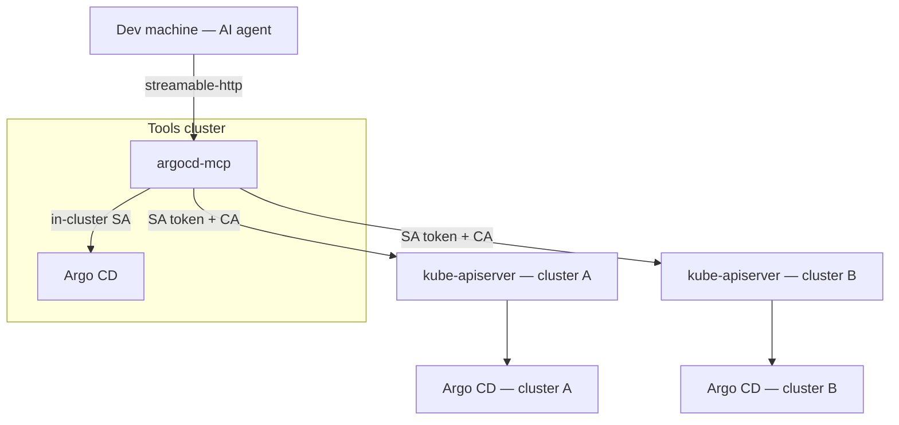
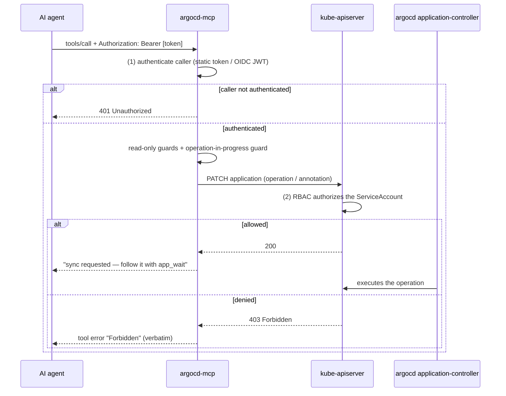

# argocd-mcp

An **MCP (Model Context Protocol) server for Argo CD**. It lets an AI agent
(Claude Code, Cursor, …) inspect **and operate** one or more Argo CD
installations — list applications, explain drift, **refresh**, **sync**, **wait**,
**roll back** and **terminate** operations.

It is built on one design decision: **Argo CD is driven through the Kubernetes
API, not through the Argo CD HTTP API.** Argo CD is a controller, and every
operation its API server performs is ultimately a write to the `Application`
custom resource — so this server writes that resource directly, through the
kube-apiserver of whichever cluster Argo CD runs in.

That single choice is what makes multi-cluster work with **no new ingress, no
VPN and no Argo CD account or API token**, and it puts authorization exactly
where the sibling `kubernetes-mcp` puts ikt: **Kubernetes RBAC**.

- **Reaches every cluster** — a remote Argo CD needs only a ServiceAccount with
  RBAC on `argoproj.io` in the `argocd` namespace, plus that cluster's API
  server URL and CA. Nothing has to be exposed.
- **Streamable-HTTP transport**, agent authentication via static bearer tokens
  or an OIDC provider (Authentik / Keycloak), deployable with the bundled
  **Helm chart** and **ESO**-managed secrets.
- **Deliberately narrow** — it does not re-implement pods, logs, events or
  generic Kubernetes access; that is `kubernetes-mcp`'s job.

## Topology (example)



The remote clusters' API servers are already reachable and already credentialed.
`argocd-server` is not — it is a ClusterIP Service. So the MCP uses the reachable
one and speaks Kubernetes.

## Central auth model

Two independent gates secure a call — **(1)** the agent authenticates to the MCP
(optional, [`docs/auth.md`](./docs/auth.md)), and **(2)** the MCP's
ServiceAccount is authorized by Kubernetes RBAC (always). The MCP itself holds
no policy.



## Why not the Argo CD HTTP API?

Because it cannot be reached from another cluster without exposing it, and the
obvious tunnel does not work. Routing it through the kube-apiserver's
`services/proxy` fails for two independently verified reasons:

1. The apiserver **forwards the `Authorization` header verbatim** to the backend
   Service (`k8s.io/apimachinery/pkg/util/proxy/upgradeaware.go` clones the
   request headers and strips nothing on the request path).
2. Argo CD **prefers that header over its `argocd.token` cookie**, and its check
   is purely structural — `server/server.go` `getToken` accepts any bearer value
   that `util/jwt.IsValid` likes, which is "three dot-separated segments". A
   Kubernetes ServiceAccount token is exactly that, so Argo CD takes the
   Kubernetes token, fails to verify it, and returns **401**.

So the Kubernetes API is not a workaround here — it is the only transport that
reaches every cluster with the credentials that already exist.

## Tools

All tools take an optional `instance` (defaults to the configured default) and
an optional `namespace` (defaults to the instance's Argo CD namespace).

| Tool | Purpose |
|------|---------|
| `instances_list` | managed Argo CD instances + namespaces + reachability + read-only flag |
| `apps_list` | applications with sync/health/project/revision/destination, plus filters |
| `app_get` | one application in full: sources, policy, state, conditions, recent history |
| `app_resources` | per-resource sync/health — the drift summary |
| `app_history` | sync history (the `id` for `app_rollback`) |
| `projects_list` | AppProjects with allowed repos/destinations |
| `appsets_list` | ApplicationSets with generators and owned applications |
| `app_wait` | poll until Synced (and Healthy), or until the operation finishes |
| `app_sync` * | sync, with revision / prune / dryRun / syncOptions / partial resources / strategy / retry |
| `app_refresh` * | normal or hard refresh, optionally waiting for the reconcile |
| `app_rollback` * | roll back to a history entry |
| `app_terminate_operation` * | terminate the running operation |

`*` mutating — blocked when the server or the instance is `readOnly`, and
ultimately governed by Kubernetes RBAC.

### What this server deliberately does NOT do

`pods_list`, `pods_log`, `events_list`, `nodes_list`, generic `resources_*`,
`deployment_scale`, `rollout_restart` — all of that belongs to the separate
**kubernetes-mcp** server. Run both and let the agent pick. Deleting
Applications is out of scope too: it cascades to real workloads.

## Quick start (local, against your kubeconfig)

```bash
cat > /tmp/amcp.yaml <<'EOF'
defaultInstance: dev
instances:
  - name: dev
    kubeconfigFile: /root/.kube/config
    context: my-context
    namespace: argocd
EOF
go run . --config /tmp/amcp.yaml
# MCP endpoint: http://0.0.0.0:9090/mcp   health: /healthz /readyz   metrics: :9091/metrics
```

See [`examples/config.yaml`](./examples/config.yaml) for all three credential
modes (in-cluster, explicit token+CA, kubeconfig context).

## Configure your AI agent

Full examples: [`examples/mcp.claude.json`](./examples/mcp.claude.json),
[`examples/mcp.cursor.json`](./examples/mcp.cursor.json).

```json
{
  "mcpServers": {
    "argocd-tools": {
      "type": "http",
      "url": "https://argocd-mcp.example.com/mcp",
      "oauth": {
        "clientId": "argocd-mcp",
        "authServerMetadataUrl": "https://auth.example.com/application/o/argocd-mcp/.well-known/openid-configuration"
      }
    }
  }
}
```

## Deploying

```bash
helm upgrade --install argocd-mcp oci://ghcr.io/truepace-io-oss/charts/argocd-mcp \
  --namespace argocd-mcp --create-namespace \
  --set localInstance.namespace=argocd \
  --set localInstance.rbac.tier=read-only
```

Flip `localInstance.rbac.tier=sync` once you want the mutating tools. For remote
instances see [`docs/rbac.md`](./docs/rbac.md) and
[`docs/gitops-integration.md`](./docs/gitops-integration.md).

## Security

* Two independent gates: agent auth ([`docs/auth.md`](./docs/auth.md)) and
  Kubernetes RBAC ([`docs/rbac.md`](./docs/rbac.md)).
* **Argo CD's own RBAC (`argocd-rbac-cm`) is not consulted**, because the server
  writes the CR directly. The namespaced Role bound to its ServiceAccount is the
  entire blast radius — which is why the default tier is read-only and `create`,
  `update` and `delete` are never granted.
* **The write guard.** Kubernetes RBAC is resource-scoped, so `patch` on
  `applications` would otherwise allow redirecting a sync at an arbitrary source
  via `spec.source`, `operation.sync.source` **or** `status.history[].source` —
  all three confirmed exploitable. The sync tier therefore ships with a
  `ValidatingAdmissionPolicy` that closes them, and the server verifies at
  runtime that it is in force (`amcp_write_guard_active`, and
  `writeGuard=active|MISSING` in `instances_list`). See
  [`docs/rbac.md`](./docs/rbac.md).
* A global and a per-instance `readOnly` kill-switch block mutations *before*
  any API call.
* Metrics live on a separate, unauthenticated port — never expose it.

## Testing

```bash
make test           # unit tests (fake clients, no cluster)
make test-e2e       # envtest: real kube-apiserver + the real Argo CD CRDs
make test-e2e-kind  # kind + real Argo CD: refresh → sync → wait → workload exists
make helm-lint
```

The envtest suite proves the RBAC claim (a read-only ServiceAccount gets a real
`Forbidden` on `app_sync`, and nothing is written) and both auth modes. The kind
suite is the only one with a running application-controller and is therefore the
one that proves the whole deployment path — and it is where the **write guard**
is validated: every escalation path denied, every legitimate MCP operation still
allowed, and a negative control that refuses to assert anything until the policy
is provably enforcing.

## Documentation

| Document | Contents |
|----------|----------|
| [`docs/architecture.md`](./docs/architecture.md) | transports, request flow, exact patches, guard rails |
| [`docs/auth.md`](./docs/auth.md) | static tokens, OIDC/Authentik, RFC 9728 metadata, identity attribution |
| [`docs/rbac.md`](./docs/rbac.md) | the three tiers, remote provisioning, the Argo CD RBAC caveat |
| [`docs/metrics.md`](./docs/metrics.md) | metric reference, PromQL, dashboard |
| [`docs/gitops-integration.md`](./docs/gitops-integration.md) | deploying via a myks/ytt/Argo CD GitOps repo |
