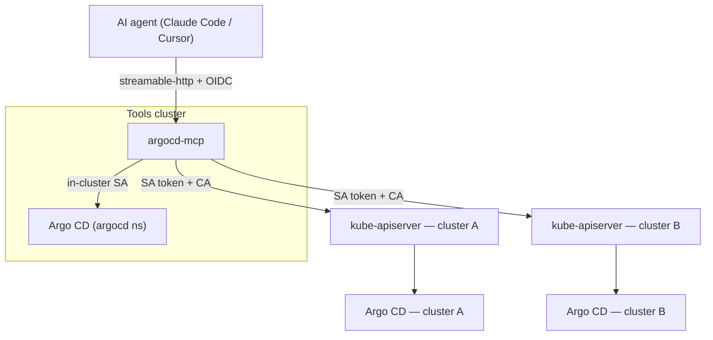
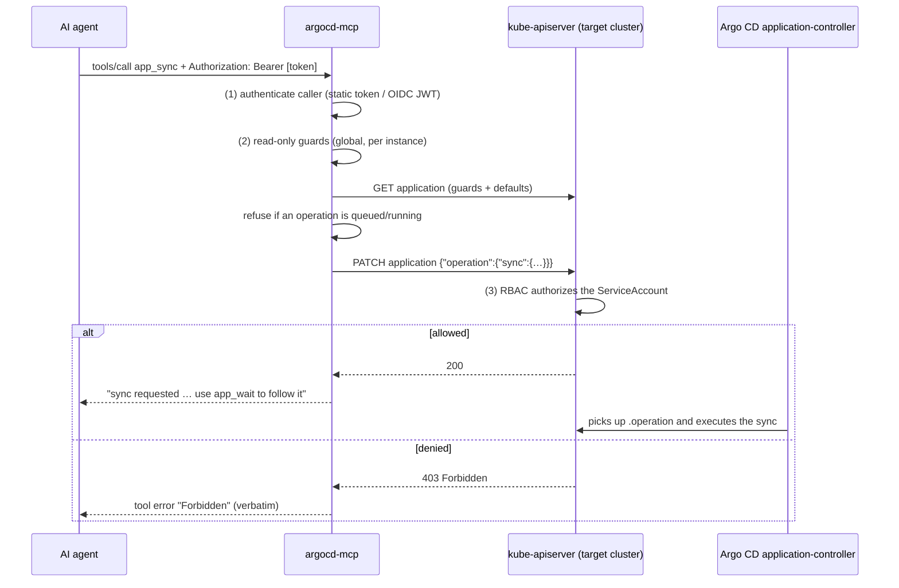
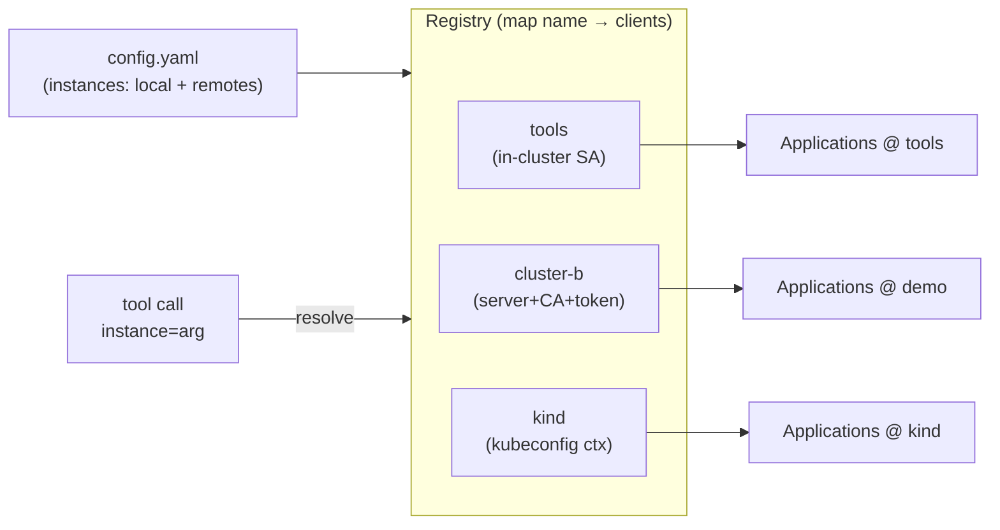

# Architecture

## The one design decision that shapes everything

`argocd-mcp` drives Argo CD **through the Kubernetes API**, by reading and
patching the `argoproj.io/v1alpha1` custom resources — not through the Argo CD
HTTP API.

That is what makes multi-cluster work without any new network path:

Every remote cluster's API server is already reachable and already
credentialed; `argocd-server` is not (it is a ClusterIP Service). So the MCP
uses the reachable one.

### Why not the Argo CD HTTP API through the kube-apiserver proxy?

Because of a hard header collision, verified in both code bases:

1. The apiserver's `services/proxy` **forwards the `Authorization` header
   verbatim** — `k8s.io/apimachinery/pkg/util/proxy/upgradeaware.go` clones the
   request headers and deletes nothing on the request path.
2. Argo CD **prefers that header over its `argocd.token` cookie**, and its check
   is purely structural (`server/server.go` `getToken` →
   `util/jwt.IsValid`, which only asserts three dot-separated segments). A
   Kubernetes ServiceAccount token is a 3-segment JWT, so Argo CD picks it up,
   fails to verify it, and answers 401. The cookie is never consulted.

A pod `portforward` tunnel would avoid the collision, but it needs tunnel
lifecycle management, pod discovery and an Argo CD account per cluster. See the
optional phase in the repository plan.

## Request flow

Gate (1) is optional agent authentication. Gate (2) is a defense-in-depth
kill-switch. Gate (3) — Kubernetes RBAC — is the real authorization decision;
the MCP contains no policy engine.

## Instance registry

Building the registry never contacts an API server, so an unreachable instance
cannot break startup. Reachability is reported by `Ping()` — which probes
`applications`, not just the cluster — and by a 30 s background prober feeding
`amcp_instance_up`.

File-based tokens/CAs are re-read on every request, so ESO-rotated credentials
are picked up without a restart.

## What each mutating tool writes

These are exactly the mutations the Argo CD API server itself performs.

| Tool | Patch (JSON merge patch on the Application) |
|------|---------------------------------------------|
| `app_sync` | `{"operation":{"sync":{…},"initiatedBy":{"username":"argocd-mcp:<caller>"},"info":[…],"retry":{…}}}` |
| `app_refresh` | `{"metadata":{"annotations":{"argocd.argoproj.io/refresh":"normal\|hard"}}}` |
| `app_rollback` | the same `operation.sync`, with `revision` and `source`/`sources` taken from `status.history[id]` |
| `app_terminate_operation` | `{"status":{"operationState":{"phase":"Terminating"}}}` |

The `Application` CRD declares `subresources: {}` — no status subresource — so
the terminate patch goes through the main resource and the ServiceAccount needs
only `patch` on `applications`. `update`, `create` and `delete` are never used.

## Guard rails

* A sync or rollback is refused while `.operation` is set or
  `status.operationState.phase` is `Running`/`Terminating`, with a message that
  names `app_terminate_operation` as the remedy.
* A rollback is refused when automated sync is enabled (the controller would
  immediately revert it) unless `force=true` is passed.
* `sync.revision` is never empty: it defaults to the application's own
  `targetRevision`, falling back to `HEAD`.
* `app_wait` clamps its timeout to 900 s and its poll interval to 1–30 s, and
  honours context cancellation.

## Scope

This server exposes Argo CD domain operations only. Pods, logs, events, nodes,
namespaces, generic `resources_*`, scaling and rollout restarts belong to the
separate **kubernetes-mcp** server and are deliberately not re-implemented here;
every tool description says so, so the model routes those questions correctly.

Deleting Applications is also out of scope — it cascades to real workloads.
